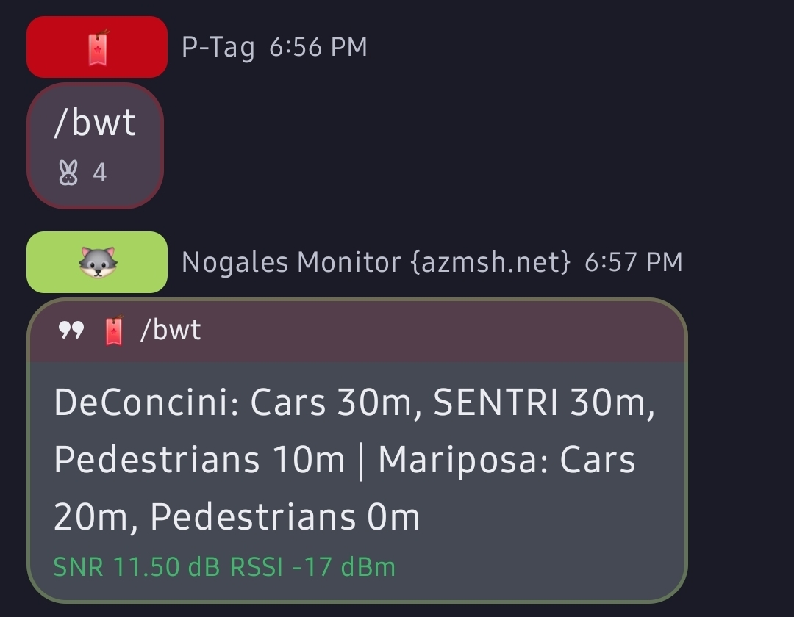

# Border Wait Times — MeshMonitor Auto-Responder Script

Reports live wait times for U.S. land ports of entry (Mexico and Canada
borders) using [CBP's public Border Wait Time RSS feed](https://bwt.cbp.gov).
No API key required.

Built for [MeshMonitor](https://github.com/Yeraze/meshmonitor)'s
[Auto Responder](https://meshmonitor.org/features/automation.html) feature.

Originally written for the Nogales, AZ ports of entry (DeConcini and
Mariposa); the script is now config-driven so any number of Mexico or
Canada crossings can be registered without touching the parsing logic.

## What it reports

By default, the ports listed in `DEFAULT_PORTS` (Nogales' DeConcini and
Mariposa out of the box):

- **DeConcini**: Passenger Vehicles (General lane), SENTRI (when available), Pedestrian
- **Mariposa**: Passenger Vehicles (General lane), Pedestrian

When a port is closed, or CBP shows "Update Pending" (e.g. outside a
port's staffed hours), the script reports `closed` rather than a stale
number.

**Example output (default ports):**

```
DeConcini: Cars 10m, SENTRI closed, Pedestrians 0m | Mariposa: Cars closed, Pedestrians closed
```

**Live on the mesh:**

```
> /bwt
DeConcini: Cars 30m, SENTRI 30m, Pedestrians 10m | Mariposa: Cars 20m, Pedestrians 0m
```



(The `SNR`/`RSSI` line your Meshtastic client shows under a reply is
radio telemetry the client adds automatically — it's not part of the
script's output.)

**Example output (querying a specific registered port):**

```
/border mariposa
Mariposa: Cars closed, Pedestrians closed
```

- `Cars` = Passenger Vehicles
- `Pedestrians` = Pedestrian
- Numbers are minutes of estimated delay

## Setup

1. Bind-mount a local `scripts/` folder into your MeshMonitor container (`docker-compose.yml`):

   ```yaml
   services:
     meshmonitor:
       volumes:
         - meshmonitor-data:/data
         - ./scripts:/data/scripts
   ```

2. Copy this script into that folder and make it executable:

   ```
   cp border_wait.py ~/meshmonitor/scripts/
   chmod +x ~/meshmonitor/scripts/border_wait.py
   docker compose up -d
   ```

3. Test it directly inside the container:

   ```
   docker exec meshmonitor python3 /data/scripts/border_wait.py
   ```

   To test a specific port lookup, set `MESSAGE` first:

   ```
   docker exec -e MESSAGE="border mariposa" meshmonitor python3 /data/scripts/border_wait.py
   ```

4. In the MeshMonitor UI: **Dashboard → Sources → Edit Source → Auto-Responder**
   (configured per-source in MeshMonitor 4.0+), add a trigger:

   - **Trigger pattern:** `border, crossing, line, garita, bwt`
   - **Script:** `border_wait.py`

5. Send `/border` or `/bwt` on the mesh for the default ports, or add a
   port name/alias after either one (e.g. `/border mariposa`,
   `/bwt blaine`) for a specific registered crossing — see
   **Registering ports** below for aliases.

## Registering ports (Mexico and Canada crossings)

All configuration lives in the `PORTS` dict near the top of the script.
Each entry looks like this:

```python
"deconcini": {
    "name": "DeConcini",
    "port_code": "260401",
    "aliases": ["deconcini"],
    "lanes": [
        ("POV", "Passenger Vehicles", "General", "Cars"),
        ("POV", "Passenger Vehicles", "Sentri", "SENTRI"),
        ("PED", "Pedestrian", "General", "Pedestrians"),
    ],
},
```

To add a new crossing:

1. **Find the port code.** Go to [bwt.cbp.gov](https://bwt.cbp.gov), open the
   crossing's detail page, and read the code out of the URL — e.g.
   `/details/08260401/POV` → port code `260401`.

   ⚠️ **Don't use CBP's "Schedule D" customs port codes for this** (the
   ones on customs paperwork / CBP's official port-code PDFs, e.g. Otay
   Mesa = `2507`). Those are a *different numbering system* from the ID
   `bwt.cbp.gov` uses internally — e.g. Otay Mesa's pedestrian crossing is
   `2506` on `bwt.cbp.gov`, not `2507`. Always pull the code from a
   `bwt.cbp.gov` URL itself, never from a general CBP port-code reference.

   **Known `bwt.cbp.gov` codes** (spot-check any of these yourself before
   relying on them — see step 4):

   | Port | Location | Code | Status |
   |---|---|---|---|
   | DeConcini | Nogales, AZ | `260401` | ✅ confirmed working (used in this script) |
   | Mariposa | Nogales, AZ | `260402` | ✅ confirmed working (used in this script) |
   | El Paso | El Paso, TX | `2402` | ✅ confirmed from live feed content |
   | San Ysidro | San Diego, CA | `2504` | ⚠️ found via bwt.cbp.gov links, not tested against the RSS endpoint |
   | Otay Mesa – Passenger | San Diego, CA | `2506` | ⚠️ found via bwt.cbp.gov links, not tested against the RSS endpoint |
   | Calexico – East | Calexico, CA | `2503` | ⚠️ found via bwt.cbp.gov links, not tested against the RSS endpoint |
   | Laredo – World Trade Bridge | Laredo, TX | `2304` | ⚠️ found via bwt.cbp.gov links, not tested against the RSS endpoint |
   | Peace Arch | Blaine, WA (Canada border) | `3004` | ⚠️ found via bwt.cbp.gov links, not tested against the RSS endpoint |

   The ⚠️ entries came from `bwt.cbp.gov`'s own site (not the Schedule D
   list), so they're far more likely to be right than a guess — but
   they weren't confirmed against the exact `rssbyportnum` endpoint this
   script calls, so treat them as a strong starting point, not a
   guarantee. Always do step 4 before adding a port to `DEFAULT_PORTS`.

   **Does the same `port_code` work for both vehicles and pedestrians?**
   Usually yes — DeConcini and Mariposa above both reuse one `port_code`
   across `POV` and `PED` (only the `crossing_type` segment of the URL
   changes), and that's the pattern this script's config is built around.
   That said, CBP's feed also exposes an `ALL` crossing-type variant that,
   for at least one port checked during this review, used a numeric ID
   that *didn't* match the port's plain code found elsewhere — so it's not
   guaranteed to be uniform everywhere. Don't assume; confirm it for each
   port you add (see step 4).

2. **Add a dict entry** with a short internal key (e.g. `"peace_arch"`), a
   display `name`, the `port_code`, one or more lowercase `aliases`
   users can type to query it directly, and a `lanes` list.

3. **Decide which lanes to report.** Each lane tuple is
   `(crossing_type, vehicle_key, lane_label, short_tag)`:
   - `crossing_type` — CBP feed type: `"POV"` (personal vehicle), `"PED"`
     (pedestrian), or `"COV"` (commercial vehicle).
   - `vehicle_key` — the block heading in the feed, typically
     `"Passenger Vehicles"`, `"Pedestrian"`, or `"Commercial Vehicles"`.
   - `lane_label` — the specific lane field inside that block: commonly
     `"General"`, `"Sentri"`, `"Ready"`, or `"Nexus"`.
   - `short_tag` — what appears in the mesh reply, e.g. `"Cars"`, `"NEXUS"`.

4. **Verify the port code and lane label before trusting them.** Two
   separate things can be wrong, and both fail the same way (`n/a`):

   - **Wrong port code** — open the raw feed URL directly in a browser
     first, before writing any lane config, and check it separately for
     *every* `crossing_type` you plan to use for that port (don't assume
     `PED` or `COV` works just because `POV` did):

     ```
     https://bwt.cbp.gov/api/bwtRss/rssbyportnum/HTML/POV/<port_code>
     https://bwt.cbp.gov/api/bwtRss/rssbyportnum/HTML/PED/<port_code>
     https://bwt.cbp.gov/api/bwtRss/rssbyportnum/HTML/COV/<port_code>
     ```

     You should see a `<title>` matching the port name you expect and an
     `<item>` with real `<description>` content. If it 404s, returns an
     empty feed, or shows a different port's name, the code is wrong for
     that crossing type — don't guess at a fix, go back to `bwt.cbp.gov`
     and re-derive it from that specific port's detail page URL.

   - **Wrong lane label** — CBP's feed schema isn't perfectly uniform
     across all 328 ports. Northern (Canada) crossings use NEXUS instead
     of SENTRI for trusted travelers, some pedestrian crossings expose a
     `"Ready"` lane, and label text can otherwise vary port to port. Once
     the port code above is confirmed correct, run the script (Setup step
     3) and check the output — if a lane still comes back `n/a` even
     though the raw feed clearly has data for it, read the raw feed
     output from the URL above and match the exact `<lane_label> Lanes:`
     text CBP used.

5. **Add it to `DEFAULT_PORTS`** if you want it included in the plain
   `/border` reply with no port name — or leave it out and let people
   query it by alias, e.g. `/border blaine`.

### A note on scaling to many crossings

Meshtastic messages are short-range and the auto-responder keeps replies
well under 200 characters. Every port in `DEFAULT_PORTS` adds to *every*
default reply, so:

- Keep `DEFAULT_PORTS` to the one or two crossings your community actually
  cares about by default (e.g. the nearest one).
- Register additional crossings without adding them to `DEFAULT_PORTS`,
  and let people pull them up by name (`/border <alias>`) instead. This
  keeps replies short and lets one deployment cover a whole region (e.g.
  all the crossings along a stretch of the Mexico or Canada border) without
  every reply trying to report on all of them at once.
- If a single port's own lane list runs long (e.g. General + Sentri/Nexus
  + Ready + Commercial), consider trimming `lanes` to the ones your users
  actually ask about rather than relying on the script's truncation, which
  is a blunt last resort and can cut off a reply mid-word.
- **Deploying the same script for multiple communities?** MeshMonitor's
  Auto-Responder trigger pattern is set per-source, and this script
  already scans the full message text for any registered alias — so you
  don't have to touch `DEFAULT_PORTS` or run separate copies of the
  script to give each mesh its own default. Just set that source's
  trigger pattern to the relevant port's alias directly, e.g. a mesh near
  Blaine could use trigger pattern `blaine, peacearch` instead of
  `border, crossing, line, garita, bwt`. One `/blaine` on that mesh then
  reports only Peace Arch, automatically, from the exact same
  `border_wait.py` file and `PORTS` config everyone else is running.

## Notes

- 8-second HTTP timeout, well under MeshMonitor's 10-second script execution limit.
- Fails gracefully — if CBP's feed is unreachable, it returns a short
  "unavailable" message instead of crashing, and logs the actual error to
  stderr (`docker logs meshmonitor`).
- Each port's feed is fetched at most once per run (cached in-process),
  even if multiple lanes are requested from it.

## License

MIT — do whatever you want with this, no warranty.
